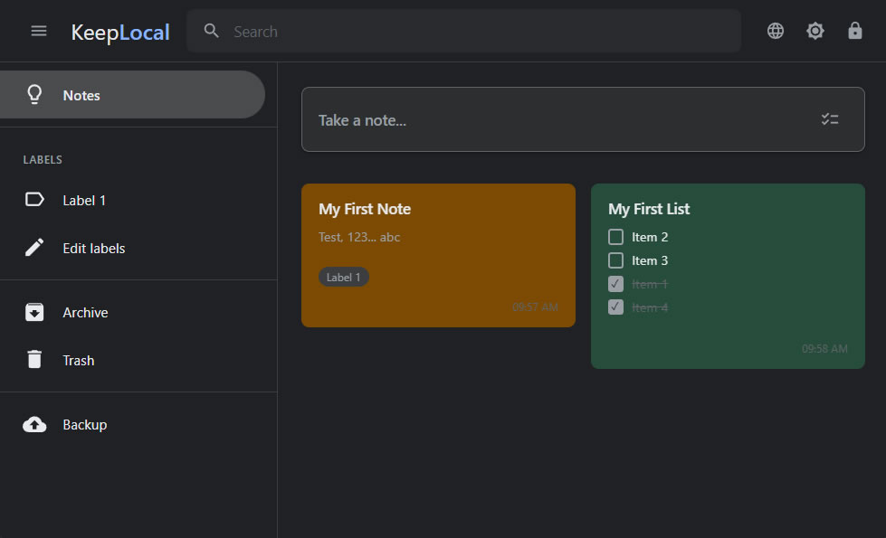

# 📝 KeepLocal — Secure Offline Notes

> 🇧🇷 [Leia em Português](README.pt-BR.md)

A Google Keep-inspired notes and task list SPA, 100% client-side with AES-256-GCM encryption. No data ever leaves your browser.



## ✨ Features

- **Text notes** with Markdown support (rendering + preview)
- **Task lists** with sub-items (1 level), drag & drop to reorder and move between pending/done
- **AES-256-GCM encryption** via Web Crypto API — each record individually encrypted in IndexedDB
- **100% offline** — no external requests, all dependencies are local
- **Themes** — dark and light
- **Colors** — 12 note colors inspired by Google Keep
- **Labels** for organization
- **Pin** to keep important notes on top
- **Archive** to store notes without deleting
- **Trash** with automatic purge after 7 days
- **Search** by title and content
- **Duplicate** notes
- **Undo/Redo** in editing modals (Ctrl+Z / Ctrl+Y)
- **Drag & drop** to reorder cards on the grid
- **Backup** — export/import encrypted data (JSON)
- **Secure session** — 5-minute idle timeout, key kept only in sessionStorage

## 🔐 Security

| Aspect | Implementation |
|---|---|
| Key derivation | PBKDF2 — 600,000 iterations, SHA-256 |
| Encryption | AES-256-GCM — random 12-byte IV per record |
| Storage | IndexedDB — only encrypted data persists |
| Session | CryptoKey exported as JWK in sessionStorage |
| Sanitization | DOMPurify applied to all Markdown output |
| Password | Minimum 8 characters, 1 uppercase, 1 special character |
| No recovery | No "forgot password" — no backdoors |

## 🚀 Getting Started

No build tools, bundlers, or dependency installation required. Just serve the files:

```bash
# With Python
python3 -m http.server 8080

# With Node.js
npx serve .

# Or any static HTTP server
```

Open `http://localhost:8080` and create your password on first use.

## 🧩 Chrome Extension

Also available as a Chrome Extension (Manifest V3):

```bash
# Build the package
./build-extension.sh

# Or load manually:
# 1. Open chrome://extensions
# 2. Enable "Developer mode"
# 3. Click "Load unpacked"
# 4. Select the chrome-extension/ folder
```

## 📁 Project Structure

```
keep_local/
├── index.html              # Entry point
├── css/
│   ├── variables.css       # Theme tokens (dark/light, colors)
│   ├── base.css            # Reset, typography, buttons
│   ├── auth.css            # Login/signup screen
│   ├── layout.css          # Sidebar, header, grid
│   ├── cards.css           # Note cards (masonry)
│   ├── modal.css           # Edit modals
│   └── components.css      # Checkbox, toast, tooltip
├── js/
│   ├── app.js              # Bootstrap, SPA router, views, modals
│   ├── auth.js             # Authentication, session, timer
│   ├── crypto.js           # PBKDF2, AES-256-GCM, import/export
│   ├── db.js               # IndexedDB wrapper
│   ├── backup.js           # Backup export/import
│   ├── theme.js            # Dark/light toggle
│   ├── history.js          # Undo/redo stack
│   ├── icons.js            # Inline SVG icons
│   └── utils.js            # UUID, debounce, formatDate, etc.
├── lib/
│   ├── marked.min.js       # Markdown parser (v15.0.12)
│   └── purify.min.js       # DOMPurify (v3.3.3)
├── chrome-extension/       # Chrome Extension package
│   ├── manifest.json       # Manifest V3
│   ├── service-worker.js   # Background script
│   ├── privacy.html        # Privacy policy
│   └── icons/              # Icons 16/48/128 PNG
└── docs/
    └── Prompt.txt          # Original project prompt
```

## 🛠️ Stack

- **HTML5** + **CSS** (native CSS Nesting) + **Vanilla JavaScript** (ES Modules)
- **Web Crypto API** — native browser cryptography
- **IndexedDB** — structured local storage
- **marked.js** — Markdown rendering
- **DOMPurify** — XSS sanitization
- **No frameworks, bundlers, or build dependencies**

## 📋 Browser Requirements

Modern browsers with support for:
- CSS Nesting
- Web Crypto API
- IndexedDB
- ES Modules

Chrome 120+, Firefox 117+, Edge 120+, Safari 17.2+

## 📄 License

[MIT](LICENSE)

## 📄 Licença

MIT
